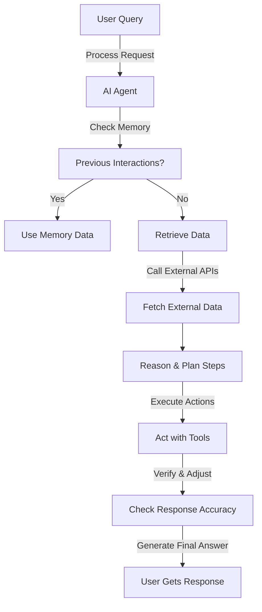

# AI Agents & Compound AI: The Future of Intelligent Systems in 2024

## Introduction
Artificial Intelligence (AI) has evolved significantly in recent years, and 2024 is poised to be the year of AI Agents. The shift from monolithic models to **Compound AI Systems** has enabled more modular, adaptable, and intelligent AI applications.

This post explores the concept of AI agents, compound AI, key terminologies, and how they work together to enhance the reasoning and action capabilities of AI systems with real-world examples.

---

## 🌟 What are AI Agents?
AI Agents are intelligent systems that can reason, plan, and take action autonomously. Unlike traditional AI models that operate in isolation, AI agents:
- **Reason**: They break down complex problems into smaller tasks.
- **Act**: They leverage external tools (APIs, databases, search engines) to complete tasks.
- **Remember**: They retain past interactions and decisions to improve future responses.

### 🤖 The Shift: From Monolithic Models to Compound AI
Monolithic AI models are limited to their training data, making them rigid and hard to adapt. **Compound AI Systems** introduce modularity, allowing AI to:
- Connect with **external databases** 📂
- Integrate with **programmatic tools** ⚙️
- Improve responses with **retrieval-augmented generation (RAG)** 🔎

By designing AI as a system, rather than a standalone model, we unlock new levels of intelligence and flexibility.

---

## 🏗️ System Approach: Compound AI Explained
### 🔥 Example 1: Vacation Planning AI
A traditional AI model struggles to answer a vacation-related query because it lacks access to personal vacation records. However, a **Compound AI System** solves this by integrating multiple components:

1. **User Query**: "How many vacation days do I have left?"
2. **Control Logic**: AI determines which tools to use.
3. **Database Query**: Fetch vacation days from an HR database.
4. **Response Generation**: AI constructs a natural language response.

Using **retrieval-augmented generation (RAG)**, the system ensures accurate and context-aware responses.

### 🏦 Example 2: AI-Powered Financial Assistant
A user asks: "How much have I spent on dining in the last three months?"

1. The AI recognizes the query and extracts key details (category: dining, timeframe: three months).
2. It queries a **banking API** to fetch transaction records.
3. It filters the data and calculates the total spending on dining.
4. The AI then generates a meaningful response with insights, such as spending trends.

This AI system acts like an intelligent financial planner, combining reasoning, data retrieval, and action execution.

### 🏥 Example 3: AI in Healthcare
A doctor asks: "What are the best treatment options for a diabetic patient with hypertension?"

1. The AI retrieves patient history from an **electronic health record (EHR) database**.
2. It consults the latest medical research from a **clinical trials database**.
3. It cross-references treatment guidelines and provides a personalized recommendation.
4. If needed, it can summarize key findings and suggest next steps.

Here, AI improves efficiency by combining **medical knowledge, patient data, and evidence-based recommendations**.

### 🏬 Example 4: AI Agent for Automated Customer Support
A customer asks: "Why was my refund rejected?"

1. The AI agent first **retrieves the refund request status** from a CRM system.
2. It checks **company policies** to understand the rejection reason.
3. If possible, it suggests an alternative resolution, such as resubmitting the request with additional details.
4. It generates a natural language response, ensuring the customer receives a clear explanation.

---

## 🛠️ AI Agent Components: What You Need to Build One
To build an AI agent, the following components are required:

| Component  | Description |
|------------|------------|
| **Large Language Model (LLM)**  | The AI model that generates responses & reasoning. Examples: OpenAI GPT-4, Anthropic Claude, Google Gemini. |
| **Control Logic**  | Determines how an AI agent processes queries and selects actions. |
| **Databases**  | Stores structured knowledge that the AI can query, such as HR records, financial data, or product inventory. |
| **APIs/Tools**  | External integrations that allow the AI to fetch real-time information, such as weather APIs, search engines, or financial transaction APIs. |
| **Memory**  | Allows the AI to remember past interactions, enhancing personalization. |
| **Reinforcement Mechanism**  | Feedback loop for AI improvement through human oversight or machine learning techniques. |

---

## 🔍 Key Terminologies in AI Agents
1. **LLM (Large Language Model)** – A deep learning model trained on vast text data to understand and generate human-like text.
2. **Retrieval-Augmented Generation (RAG)** – A method where AI retrieves external information before generating an answer to ensure accuracy.
3. **Control Logic** – The rules and logic that determine how an AI agent processes queries and interacts with different tools.
4. **ReAct Framework** – A reasoning and acting approach for AI agents to think step-by-step before answering.
5. **Autonomous Agent** – An AI system that can operate without constant human intervention, making decisions based on pre-defined logic and real-time data.
6. **APIs (Application Programming Interfaces)** – External services or tools that AI can call to retrieve specific information, such as weather, stock prices, or medical research.
7. **Memory Persistence** – AI's ability to store and recall past interactions to provide personalized experiences.
8. **Vector Database** – A database optimized for storing and retrieving high-dimensional embeddings used in search and AI models.

---

## 🔄 AI Agent Flowchart
The following **Mermaid flowchart** illustrates the step-by-step process of an AI agent:

This modular approach makes AI agents powerful problem solvers.

---

## 📌 Key Takeaways
✅ **Compound AI** improves AI adaptability by integrating multiple tools.  
✅ **AI Agents** add reasoning, acting, and memory capabilities.  
✅ **ReAct** enables step-by-step problem-solving, making AI more dynamic.  
✅ **The future is AI autonomy**, allowing agents to handle complex, multi-step tasks efficiently.

---

## 📢 Conclusion
AI Agents & Compound AI Systems are transforming AI into more **flexible, intelligent, and autonomous** assistants. As 2024 unfolds, we’ll see an explosion of **agentic AI** applications, making AI systems more capable than ever.

🚀 **Want to build AI Agents?** Start by integrating AI models with databases, APIs, and control logic. Let’s innovate together!  

💡 **Follow for more AI insights & code samples!** 🎯
